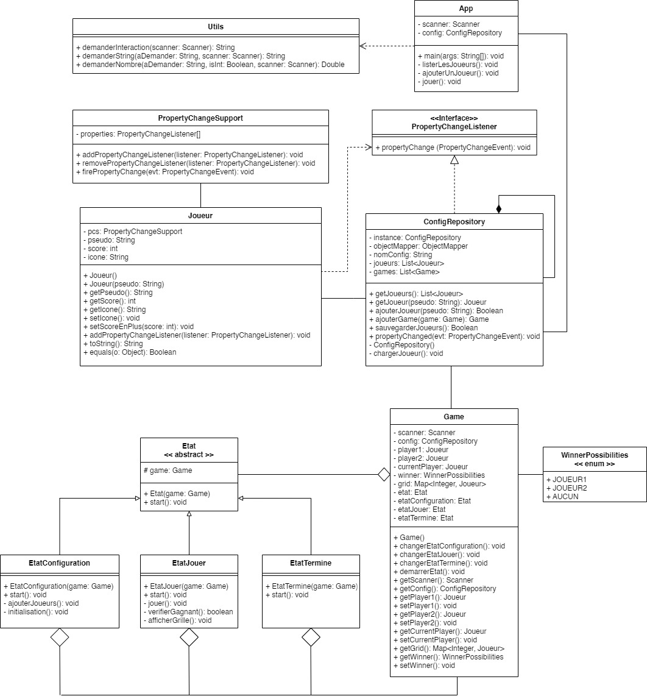
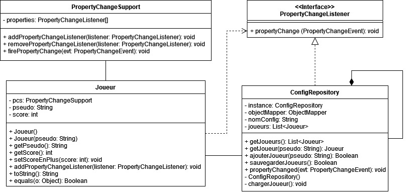
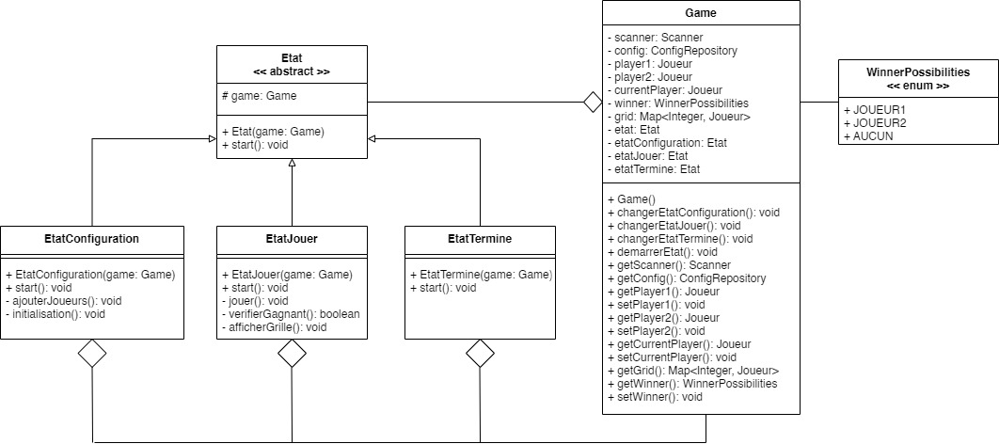

# MorpionDesignPatterns (GERAY & BAGLAN)

## Modélisation UML du projet
 

  

## Les Design Patterns utilisés

###  1. Le Singleton
 

  

Le Singleton est utilisé dans le cas du `ConfigRepository` car le fait qu'il y ait qu'une seule instance de `ConfigRepository` nous assure que c'est uniquement sa propiété `joueurs` qui est utilisée/mise à jour. Également, le fait qu'il n'y ait pas plusieurs instances nous assure que plusieurs instances n'essayeront pas d'accéder au fichier `config.json` en même temps, ce qui pourrait poser problème et amener à des pertes de données.

###  2. L'Observer
 

  

L'Observer est utilisé dans le cas du `ConfigRepository`, pour qu'il observe ou qu'il soit tenu informé de chaque changement de chaque `Joueur`. Ainsi à chaque changement d'un `Joueur`, en l'occurence à chaque `setScoreEnPlus(int score)`, le `ConfigRepository` appelle sa méthode `sauvegarderJoueurs()` laquelle sauvegarde cette dernière modification.

###  3. Le State
 

  

Le State est utilisé lorsqu'on souhaite lancer une partie de Morpion en utilisant la classe `Game`. Une partie peut avoir différents états :
- l'état de **Configuration**, est l'état initiale d'une partie pour sa préparation : ajout des joueurs, génération des icônes et du joueur débutant la partie aléatoirement.
- l'état **Jouer**, qui débute après la configuration et où les deux joueurs jouent à tour de rôle tant qu'il n'y pas de gagnants ou que la partie n'est pas nulle.
- l'état **Termine**, qui se lance une fois la partie terminée afin d'afficher le résultat et d'ajouter les points au vainqueur si la partie n'est pas nulle.